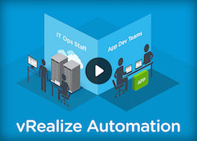
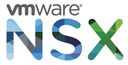

# vmw-openstack
All about Openstack with VMware solutions :-)  
VMware provide drivers and plugin in order to integrate vSphere,vSAN and NSX with Openstack. The usefull links:  
- [VMware vSphere Driver : Nova + vSphere](http://docs.openstack.org/trunk/config-reference/content/vmware.html)  
- [VMware VMDK Driver : Cinder + vSphere](http://docs.openstack.org/trunk/config-reference/content/vmware-vmdk-driver.html)  
- [VMware NSX Plugin : Neutron + NSX](https://wiki.openstack.org/wiki/Neutron/VMware_NSX_plugins)  

## vRealize Automation

- [vra-openstack](vra-openstack/README.md) : all that your need to know to integrate openstack with vRealize Automation

## VIO

- [VIO](vio/README.md) : scripts, conf files and tips for VMware Integrated Openstack, vCenter and NSX-V

## Fuel

- [vnw-fueled](vmw-fueled/README.md) : scripts, conf files and tips for Mirantis Fuel with VMware vCenter & VDS plugins
- [vnw-nsx-fueled](vmw-nsx-fueled/README.md) : scripts, conf files and tips for Mirantis Fuel with VMware vCenter & NSX-V plugins

## Autopilot/Landscape

- [vnw-autopiloted](vmw-autopiloted/README.md) : scripts, conf files and tips for Canonical Landscape + Autopilot with VMware vCenter & NSX-V plugins

