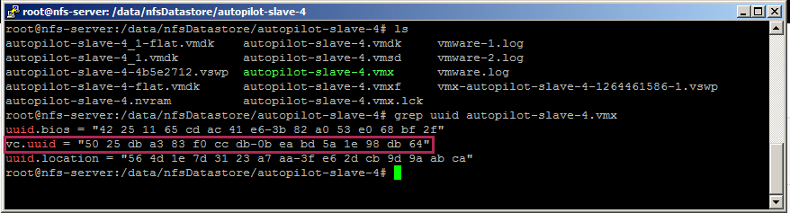
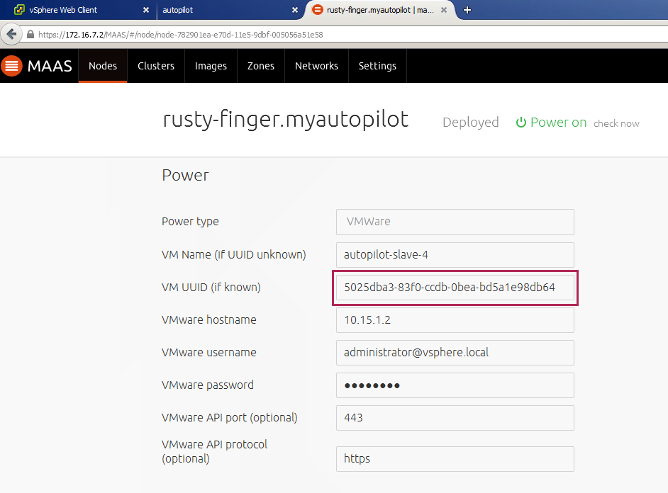

# Ubuntu Openstack with vCenter/NSX-V plugins 

## How to setup correctly slave node in Landscape
There are tricky tips in order to allow Landscape managing direclty powerstate of VMs
   
1. After deploying a slave node, you have to retrieve the vc.uuid from the vmx file on ESX or from the datastore 

2. Reformat the uuid with this translation schemas
  * from "16S-16S" to "8S-4S-4S-4S-12S"
  * Example: "50 25 db a3 83 f0 cc db-0b ea bd 5a 1e 98 db 64" to "5025dba3-83f0-ccdb-0bea-bd5a1e98db64"

3. Modify the node slave in Landscape like the example below, now Lamdscape is able to deploy the env

