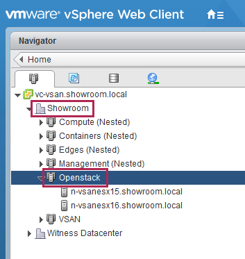
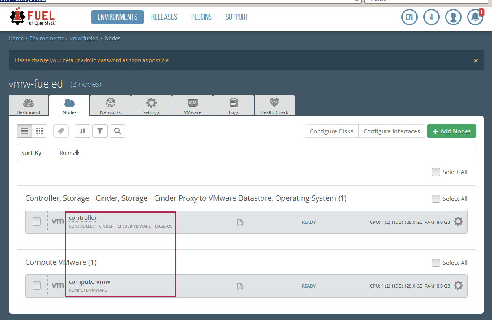
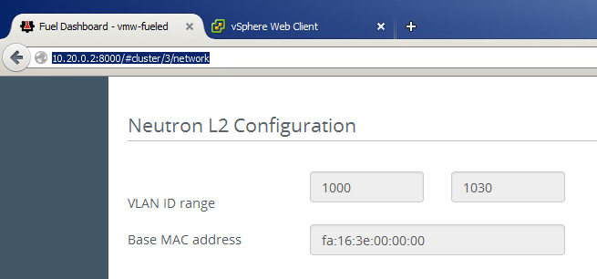
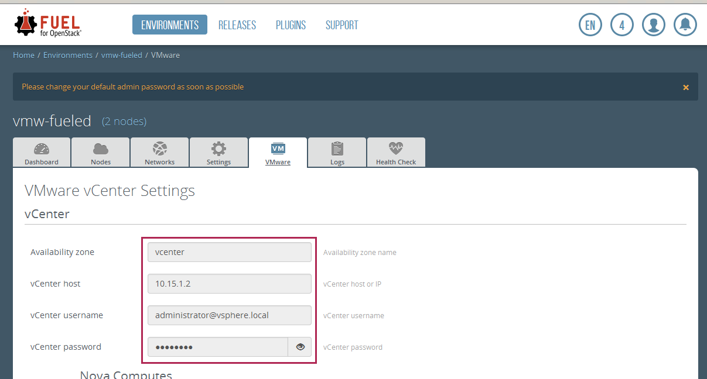
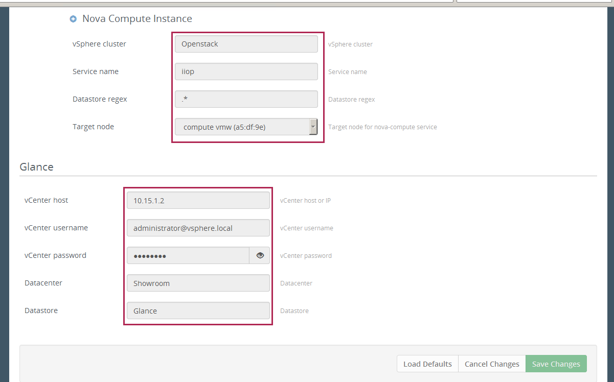
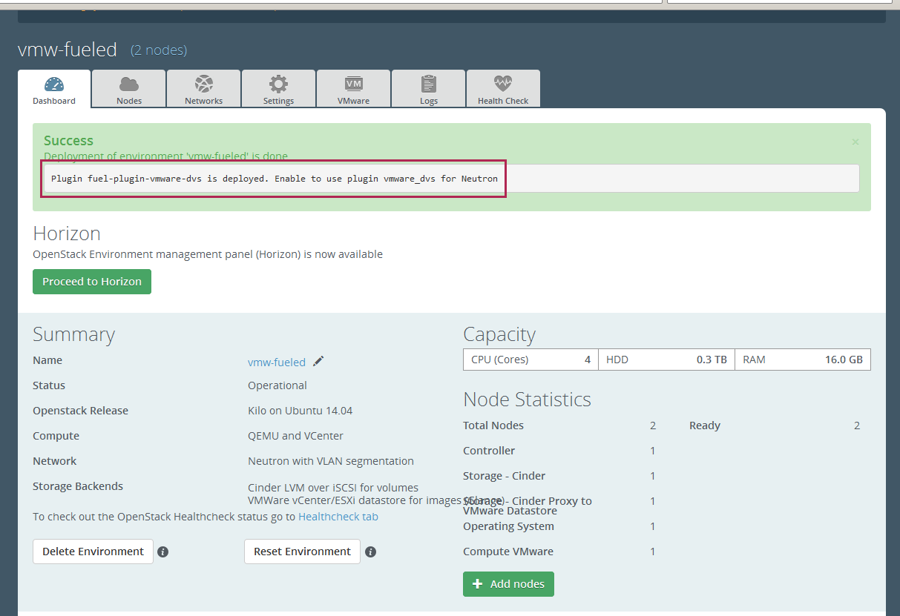
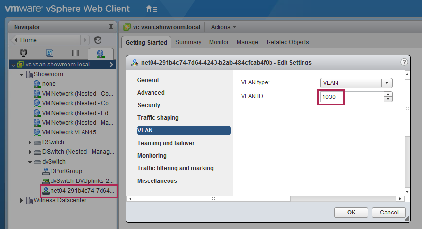

# Fuel 7.0 with vCenter/VDS Plugins 

Assuming you have an Up & Running vCenter 6.0 with bunch of ESX 6.0 and an fully operationnal Fuel 7.0 Master node with at least 2 Fuel Slave nodes. (My lab is nested without any issues. If it's also your case, don't forget to set the VSS or VDS in promiscous mode for physical ESX.)

## vCenter Preparation

1. Create a datacenter with a cluster, example with 'Openstack' Cluster within 'Showroom' datacenter


2. Create a VDS like the 'dvSwitch' below and attach hosts of 'Openstack' Cluster


## Fuel Preparation

1. [Download](http://plugins.mirantis.com/repository/f/u/fuel-plugin-vmware-dvs/fuel-plugin-vmware-dvs-1.1-1.1.0-1.noarch.rpm) and install VDS plugin for Fuel 7.0 on master node 
 ```bash
 [root@fuel ~]# fuel plugins --install fuel-plugin-vmware-dvs-1.1-1.1.0-1.noarch.rpm
 ```

2. Create a dedicated Fuel env for vCenter with QEMU + vCenter options and attach 2 nodes
  * One with "controller+cinder+cinder-vmware+base-os" roles
  * One with only "compute-vmware" role
   
 

3. Configure networks and check Neutron L2 configuration with the VLAN range, for each neutron network there is a dedicated PORTGROUP
   
 

4. Configure the vCenter plugin, like the example below
 
  * Select the "compute-vmware" node as target node
  * In my case I have a NFS Datastore acting as Glance repository
   
 

5. Deploy the env


## Consume openstack as usual
  * Creation of a new network == creation of a new PORTGROUP in VDS with a VLANID taken in the range
  * Spawn a VM in neutron network == the VM VNIC is attached to the corresponding PORTGROUP by vCenter

Example of corresponding PORTGROUP to neutron network, automatically created by VDS plugin


# Cheat Sheet
[Openstack saved configuration files for this examples](scripts/vmw-fuel-dvs.tgz)

