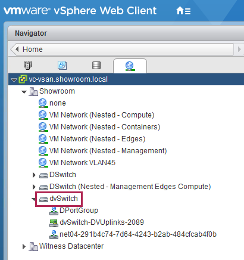

# Fuel 7.0 with vCenter/VDS Plugins 

Assuming you have an Up & Running vCenter 6.0 with bunch of ESX 6.0 and an fully operationnal Fuel 7.0 Master node with at least 2 Fuel Slave nodes. (My lab is nested without any issues. If it's also your case, don't forget to set the VSS or VDS in promiscous mode for physical ESX.)

## vCenter Preparation

1. Create a datacenter with a cluster, example with 'Openstack' Cluster within 'Showroom' datacenter


2. Configure the network tab and specify the VLAN range, for each neutron network there is a dedicated portgroup the VLAN ID


3. Create a VDS like the 'dvSwitch' below and attach hosts of 'Openstack' Cluster


4. Download and install VDS plugin into Fuel Master node, verify installed plugins
```bash
[root@fuel ~]# fuel plugins --install fuel-plugin-vmware-dvs-1.1-1.1.0-1.noarch.rpm
[root@fuel ~]# fuel plugins
id | name                   | version | package_version
---|------------------------|---------|----------------
1  | fuel-plugin-vmware-dvs | 1.1.0   | 3.0.0
[root@fuel ~]#
```

5. Create a dedicated Fuel env for vCenter with QEMU + vCenter options and attach 2 nodes
  * One with controller+cinder+cinder-vmware+base-os roles
  * One with only compute-vmware role
   


6. Configure the vCenter plugin, like the example below


7. Deploy the env


8. Example of corresponding PORTGROUP to neutron network, automatically created by plugin


9. Consume openstack as usual
  * Creation of a new network, create a new VDS
  * Spawn a VM in a network and the VM VNIC is attached to the corresponding VDS by vCenter

10. Saved oconfiguration files for this examples
[nova+glance conf files](scripts/vmw-fuel-dvs.tgz)
