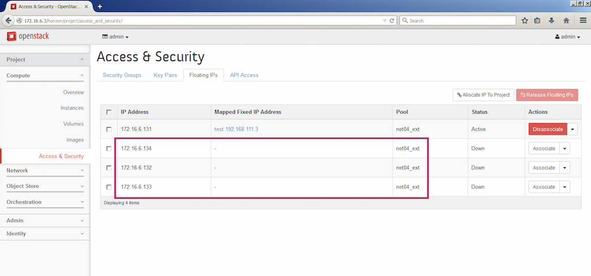
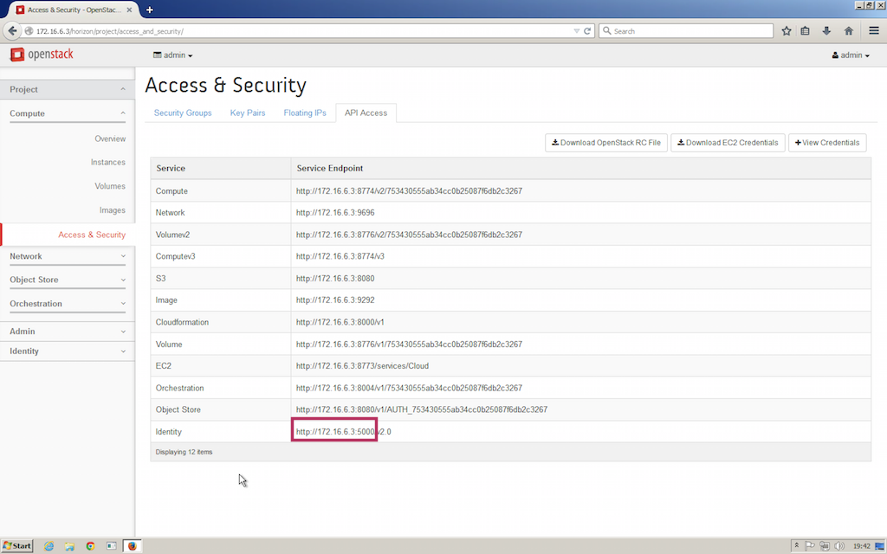

# VMware vRA and Openstack as Endpoint 

Some of you ask me to talk about vRA and Openstack integration. I'm not favorable to daisy chain CMP.
There is a risk to desynchronize all that stuff. Anyway I explain in this topic how to.

 1. Create some floating IP in advance, so vRA could discover them during the next data collection
 

 2. Identity the openstack URL in order to create OS Endpoint
 
