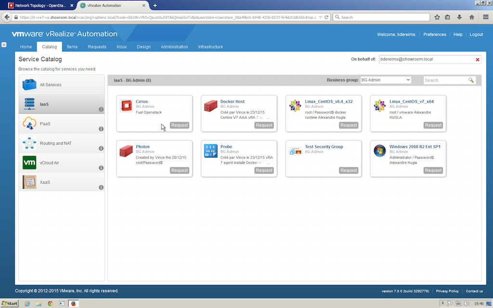
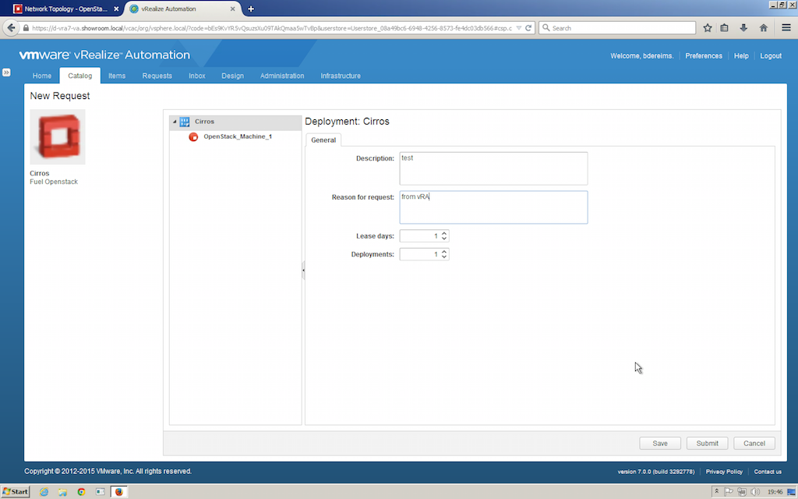

# VMware vRA and Openstack as Endpoint 

Some of you ask me to talk about vRA and Openstack integration. I'm not favorable to daisy chain CMP.
There is a risk to desynchronize all that stuff. Anyway I explain in this topic how to.

 1. Create some floating IP in advance, so vRA could discover them during the next data collection
 

 2. Identity the openstack URL in order to create OS Endpoint
 

 3. Identify network in within you want spawn VMs
 

 4. Create the OS endpoint in vRA
 

 5. Spicify OS URL, the account and the projet
 

 6. Dont't forget to modify your Fabric Group
 

 7. And add the OS resource
 

 8. Lauch data collection and verify its status
 

 9. Now you should creat a blueprint based on OS image
 

 10. Select some properties corresponding to your needs
 

 11. Publish the blueprint and modify the entitlement, assuming your are familiar with that
 

 12. Now create a new request to launch a new VM deployment
 

 13. Check the new request
 

 14. The request is submitted, everything seems to be under control...
 

 15. Yeah! VM is deployed
 

 16. Now associate a floating IP to the VM from items menu
 

 17. A quick check in Horizon
 

 18. And initiate a ssh connexion with verification
 
